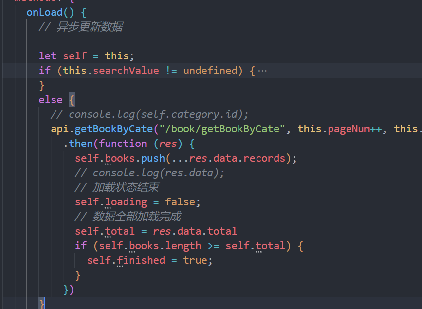
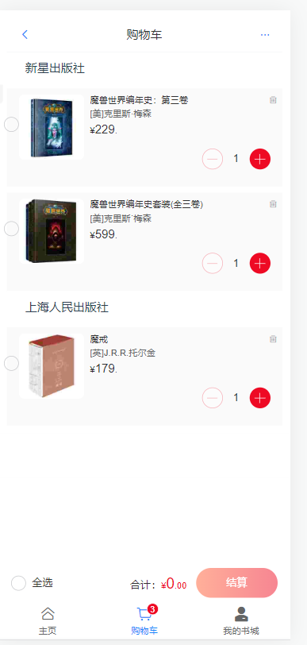
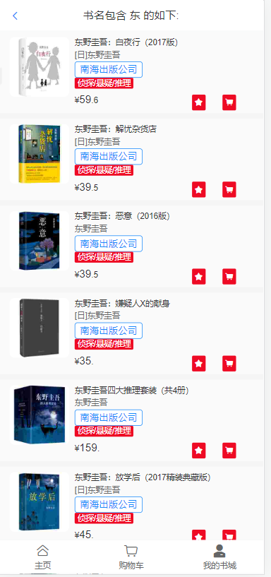
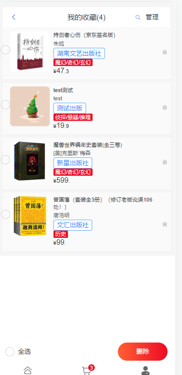

# 网上书城实验报告

---

> 本项目前后端分离，使用vue2+springboot+sqlite+jdk1.8
> 用到了vant组件以及elementUi，mybatis-plus
> 后端代码采用四层架构编写

## 主页面


+ 从封装的api接口调用 `getAllCate`方法，请求转发到后端从数据库获取书籍的全部类别

  + HomeView.vue

    ```javascript
    mounted: function () {
        this.searchFlag = false;
        let self = this;
        api.getAllCate("/category/getAllCate")
        .then(res => {
            self.categories = res.data;
            self.categories.splice(0, 0, { id: 0, name: "全部" });
            self.category = self.categories[0].id;
            // console.log(self.category);
            // console.log(res.data);
        })
    }
    ```
  + api/index.js

    ```javascript
    axios.defaults.baseURL = 'http://47.115.231.72:8899/bookstore'
    export default {
        getAllCate(url) {
            return axios({
                method: 'get',
                url: `${url}`
            })
        },
    }
    ```
+ 后端跨域使得前端访问资源

  ```java
  @Configuration
  public class InterceptorConfig implements WebMvcConfigurer {
      @Override
      public void addCorsMappings(CorsRegistry registry) {
          registry.addMapping("/**")
                  .allowedOriginPatterns("*")
                  .allowedMethods("GET","HEAD","POST","PUT","DELETE","OPTIONS")
                  .allowCredentials(true)
                  .maxAge(3600)
                  .allowedHeaders("*");
      }

      @Override
      public void addInterceptors(InterceptorRegistry reg) {
          reg.addInterceptor(new AuthInterceptor())
                  .addPathPatterns("/**")
                  .excludePathPatterns(excludePattern());
      }
  }
  ```
+ 采用子组件的方式从 `home`组件传参到 `category`组件，`props`接收分页参数调用vant里的list组件的 `onLoad`方法更新数据，实现点击类别切换
  
  

  + 使用v-bind绑定class实现css效果

  ```js
      <van-grid-item :class="{ active: i === index }" v-for="item, index in categories" :key="index" :text="item.name"
        icon="orders-o" @click="onChange(index, item)">
      </van-grid-item>
  ```
+ 后端使用[mybatisplus](https://cn.bing.com/search?q=mybatisplus)的page配合前端list实现瀑布式加载数据

  ```java
      @Override
      public Page<Book> getBookByCate(Integer pageNum, Integer pageSize, Integer category) {
  //        System.out.println(pageNum + " " + pageSize);
          Page<Book> page = new Page<>(pageNum, pageSize);
          QueryWrapper<Book> queryWrapper = new QueryWrapper<>();
          if (category == 0) {
              return this.page(page, queryWrapper);
          }
          queryWrapper.eq("category", category);
          return this.page(page, queryWrapper);
      }
  ```
+ 前端页面点击物品可以跳到书籍详情页；点击收藏图标可以收藏该书籍，同样的点击购物车可以加购该书籍，调用api接口方法add转发值后端，

  ```js
  api.add("/cart/addById", id)
      .then(res => {
          console.log(res.data);
          Toast("添加成功");
          self.$store.dispatch('setCartNum');
      })
  ```

  使用 `post`请求添加至购物车，将购物车数量存至 `vuex`中，`actions`异步调用，使用 `event.stopPropagation()`阻止点击事件的传播，使得不会跳转到详情页；

## 书籍详情

+ 前端点击可进入详情页，图片旁可以收藏该书籍，逻辑与主页面一致，下方用 `slice`截取该书籍评价列表的前三个显示，点击可查看全部评价，下方可以加入购物车
    
    
    其他页面跳转至详情页时query路由带一个书籍id参数，向后端发送请求，返回的数据使用 `etc`放入类别 `cateName`以及是否收藏 `isFavor`

    ```java
    @TableField(exist = false)
    private Object etc;

    @SuppressWarnings("unchecked")
    public void put(String key, Object value) {
        if(etc == null) {
            etc = new HashMap<String, Object>();
        }
        ((Map<String, Object>) etc).put(key, value);
    }
    ```

    ```java
    Book book = bookService.getById(id);
    book.put("cateName",categoryService.getCateById(book.getCategory()).getName());
    book.put("isFavor", favorService.getFavor(book.getId()) == null ? 0 : 1);
    result.setData(book);   
    ```

## 购物车

+ 前端先发送获取用户信息的请求，根据返回状态码判断 `token`是否过期，再发送获取购物车数据的请求，用对象数组将购物车根据出版社进行分类

  ```js
  [
      {
          publisher: "xxx"
          books: [
                  {},
                  {}
          ]
      },
      {
          publisher: "yyy",
          book: [...],
      }
  ]
  ```

  

  + 跟收藏书籍的一样将购物车数量也存 `vuex`中，方法放 `store.js`中方便多处调用

    ```js
    actions: {
        setCartNum(context) {...
        },
        setFavorNum(context) {...
        }
    },
    ```
  + 数量的增减绑定函数

    ```js
    <van-stepper theme="round" :value="book.num" @plus="addNum(book.bookId)"
    @minus="subNum(book.bookId)" />
    ```

    增加时判断是否已在购物车中，在则数量+1
  + 购物车的删除
    书籍右边有个删除图标可以删除该书籍，也可以点击右上角的三个点可以进行管理，批量删除
    
    将选中的书籍id放进数组，用 `join(",")`转成带 `,`的字符串传给后端，后端再将其转为数组进行删除

    ```java
    List<String> list = new ArrayList<>();
    String[] array = ids.split(",");
    for (String i:array) {
        list.add(i);
    }
    ```
  + 购物车的勾选
    单选与全选通过一个flag参数来区别，将ids用post请求传给后端，后端遍历数组写勾选的逻辑

    ```js
    if (flag == 0) {
            api.updateByIds("/cart/updateByIds", ids)
                .then(res => {
                    // console.log(res.data);
                    self.checkAll();
                })
        }
        else if (flag == 1) {
            // this.$refs.checkboxGroup.toggleAll(!this.allCheck);
            api.updateByIds("/cart/updateByIds", this.ids.join(","))
                .then(res => {
                    // console.log(res.data);
                    self.getCart();
                    self.checkAll();
                    // this.reload();
                })
            // console.log(this.allCheck);
        }
    ```

    ```js
    checkAll() {
        let flag = 0;
        for (var item of this.books) {
            if (item.checked == 0) {
                this.allCheck = false;
                break;
            }
            else
                flag++;
            if (flag == this.books.length)
                this.allCheck = true;
        }
    },
    ```

    ```java
    List<String> list = new ArrayList<>();
    String[] array = ids.split(",");
    for (String id:array) {
        list.add(id);
    }
    queryWrapper.in("book_id", list).eq("user_id", Integer.valueOf(userId)).eq("checked", 0);
    List<Cart> cartList = this.list(queryWrapper);
    Boolean allCheck = true;
    if (cartList.size() != 0)
        allCheck = false;
    if (allCheck) {
        List<Cart> list1 = this.getCartByUserId();
        for (Cart cart: list1) {
            cart.setChecked(0);
            this.update(cart);
        }
    }
    else {
        for (Cart cart: cartList) {
            cart.setChecked(1);
            this.update(cart);
        }
    }
    ```
+ 购物车数据后端根据前端请求头的 `Authorization`确定用户id，从数据库获取

  ```java
  QueryWrapper<Cart> queryWrapper = new QueryWrapper<>();
  String token = request.getHeader("Authorization");
  //  System.out.println("token" +token);
  String userId = JwtUtil.validateToken(token);
  queryWrapper.eq("user_id", Integer.valueOf(userId));
  return this.list(queryWrapper);
  ```

## 注册

+ 用户可以进行注册
  
  用正则表达式验证用户名
  ```js
  checkName() {
    var flag = /^[-_a-zA-Z0-9]{4,16}$/;
    if (this.username == '')
      this.tip = "用户名不能为空";
    else if (!flag.test(this.username))
      this.tip = "用户名需为4到16位，字母数字下划线，减号"
    else
      this.tip = ''
  },
  ```

  注册后根据后端请求返回的 `statusCode`判断是否已注册；然后跳转至登录页面自动填写好信息

## 登录交互

+ 游客状态(没登录)
  游客状态只能浏览书籍以及搜索，查看书籍的信息
  
  相关敏感操作需要登录
+ 后端拦截器将不敏感资源放行
  InterceptorConfig.java

  ```java
  public List<String> excludePattern(){
      List<String> ret = new ArrayList<String>();
      ret.add("/user/login");
      ret.add("/user/register");
      ret.add("/book/*");
      ret.add("/comment/*");
      ret.add("/category/*");
      // ret.add("/favor/*");
      return ret;
  }
  ```
+ 前端从浏览器本地仓库判断token是否存在，从而是否需要登录

  ```js
  const token = localStorage.getItem('Authorization');
  if (!token)
  ```

  
  没有账号可以点击去注册
  
+ **登录逻辑**

  + 输入账号密码后将表单数据传给 `login`方法，请求头设置为json格式
    ```js
    login(url,user){
        return axios({
            method:'post',
            url:`${url}`,
            data:user,
            transformRequest:[function(data){
                return JSON.stringify(data,{allowDots:true})
            }],
            headers: {
                'Content-Type': 'application/json'
            }
        })
    },
    ```
  + 前端在 `main.js`里设置请求拦截器，每次请求都在请求头加上 `Authorization`字段，也就是 `token`
    ```js
    axios.interceptors.request.use(
    config => {
        if (localStorage.getItem('Authorization')) {
        config.headers.Authorization = localStorage.getItem('Authorization');
        }
        return config;
    },
    error => {
        return Promise.reject(error);
    });
    ```
  + 后端对没排除在外的路径进行拦截处理(敏感资源)
    ```java
    public class AuthInterceptor implements HandlerInterceptor {
        @Override
        public boolean preHandle(HttpServletRequest req, HttpServletResponse resp, Object o) throws Exception{
            System.out.println("进入拦截器");
            if(req.getMethod().equals("OPTIONS")){
                resp.setStatus(HttpServletResponse.SC_OK);
                return true;
            }
            resp.setCharacterEncoding("utf-8");
                    String token = req.getHeader("Authorization");
                    String id = JwtUtil.validateToken(token);
                    if (id == "") {
                        System.out.println("认证失败, token过期");
                        resp.sendError(414);
                        return false;
                    }
            resp.setCharacterEncoding("UTF-8");
            resp.setContentType("application/json; charset=utf-8");
            return true;
        }
    }
    ```

    token根据用户id生成，Jwt验证token `validateToken`，若token过期会返回 `""`
  + `sqlite`数据库的 `password`字段使用密码+密钥 `salt`MD5双重加密，`salt`采用UUID随机生成 `UUID.randomUUID().toString()`
    ```java
    public static String getEncode(String pwd, String salt) throws Exception {
        return md5Encode(md5Encode(md5Encode(pwd))+salt);
    }
    ```

    将生成token存入数据库
    `JwtUtil.generateToken((isUser.getId()).toString()))`
  + 后端 `login`登录方法，将 `password`字段先用MD5加密后再与数据库进行比较，校验后返回 `token`
    ```java
        String password = MD5Util.getEncode(user.getPassword(), isUser.getSalt());
        if(password.equals(isUser.getPassword())) {
            result.success("登录成功");
            Map<String,Object> map = new HashMap<>();
            isUser.setSalt(null);
            isUser.setPassword(null);
            map.put("user", isUser);
            map.put("Authorization", JwtUtil.generateToken((isUser.getId()).toString()));
            result.setData(map);
        }
    ```
  + 前端根据后端返回的状态码判断是否登录成功
    ```js
    if (res.statusCode == 200) {
        Toast("登录成功");
        self.$store.commit('setUser', {
            Authorization: res.data.Authorization,
            username: res.data.user.username,
            nickname: res.data.user.nickname,
        })
        self.$store.commit('setCartNum')
        self.$router.push({ path: '/frontUser' })
    }
    else if (res.statusCode == 600) { //账号或密码错误
        Toast(res.message)
        self.username = ""
        self.password = ""
    }
    ```
  + 前端添加响应拦截器，若 `token`过期则跳转登录界面提示用户重新登录
    ```js
    axios.interceptors.response.use((success) => {
    if (success.status && success.status == 200) {}
    return success.data;
    }, (error) => {
    // console.log(error.response);
    if (error.response.status == 504 || error.response.status == 404) {
        Toast("服务器被吃了")
    } else if (error.response.status == 414) {
        if (localStorage.getItem('Authorization')) {
        Toast("token过期，请登录")
        router.replace('/login')
        }
    } else {
        if (error.response.message) {
            Toast(error.response.message)
        }
    }
    });
    ```
+ 客户状态(已登录)
  将用户数据存至 `localStorage`

  ```js
  setUser(state, user) {
    localStorage.setItem('username', user.username);
    localStorage.setItem('nickname', user.nickname);
    localStorage.setItem('Authorization', user.Authorization);
    // state.user.Authorization = user.Authorization;
    // state.user.username = user.username;
  },
  ```

## 搜索页面

+ 可以根据不同选项去搜索
  
+ 搜索页面与类别页面共用
  
  当搜索时，数据从 `searchBookByKey`方法请求后端获取，与主页面展示基本一致，同样可以点击进入详情与收藏，加购

  ```js
  searchBookByKey(url, pageNum, pageSize, option, key) {
      return axios({
          method: 'get',
          url: `${url}`,
          params: {
              pageNum: pageNum,
              pageSize: pageSize,
              option: option,
              key: key
          }
      })
  },
  ```

  后端接收参数获取数据库数据返回前端

## 订单

+ 购物车点击结算
    
    可以修改地址
    

+ 前端订单页面使用vant的tab标签页切换各个类别的订单，每单右下角有相应的操作
    + 前端订单根据切换的`index`向后端请求对应的数据
    + 待付款
        
        不付款订单5分钟后自动取消
        
        
        **后端实现**
        订单类继承`Delayed`，实现其两个方法`compareTo`，`getDelay`
        ```java
        public class Order extends BaseEntity implements Delayed {
        
        ...

        @ApiModelProperty(value = "订单取消时间，DelayQueue使用")
        @TableField(updateStrategy = FieldStrategy.IGNORED)
        private Date cancelTime;

        ...

        @Override
        public long getDelay(TimeUnit unit) {
            return unit.convert(cancelTime.getTime() - System.currentTimeMillis(), TimeUnit.MILLISECONDS);
        }
        @Override
        public int compareTo(Delayed o) {
            return cancelTime.compareTo(((Order) o).getCancelTime());
        }
        }
        ```
        使用`DelayQueue`将订单类加入延迟队列中，新建一个线程
        ```java
        private DelayQueue<Order> queue = new DelayQueue<>();
        @Resource
        private ThreadPoolTaskExecutor executorService;
        ```
        ```java
        executorService.submit(()->{
            try {
                queue.add(order);
            } catch (Exception e) {
                e.printStackTrace();
            }
        });
        return queue;
        ```
        设置过期时间5分钟
        ```java
        order.setCancelTime(DateUtil.offset(date, DateField.MINUTE, 5));
        ```
        过期时从队列取出，调用cancel取消方法
        ```java
        Order order = queue.take();
        this.cancel(order.getId(), "超时自动取消");
        ```
        若用户继续付款，则将该订单从队列里移除
        ```java
        if (order.getStatus() == 1) {//继续付款，从超时队列里删除
            order.setCancelTime(null);
            for (Order q:queue)
                if (q.getId().equals(orderId))
                    queue.remove(q);
        }
        ```
        **前端实现**
        使用vant组件的倒计时，获得从后端返回的时间
        ```js
        <van-count-down v-if="book.status == 1" :time="time(book)" @finish="finish(book)">
        ```
        ```js
        time(book) {
            console.log(book.etc.cancelTime, "取消时间")
            // console.log(Date.now());
            return book.etc.cancelTime - Date.now()
        },
        ```
    + 待发货
        
        后台管理员进行发货
        
        用户可以手动取消订单，逻辑与自动取消相似
        
        
    + 待收货
        
    + 待评价
        
        点击按钮后路由跳转，向后端发送请求完成评价后自动跳转我的评价页面
    + 待追评
        逻辑与评价基本一致，若有追评会显示
        

## 我的书城

+ 显示个人信息
    
+ 右边设置可以跳转，查看头像及用户名
    
    可以查看收货地址
     
    使用[vant](https://vant-contrib.gitee.io/vant/v2/#/zh-CN/)件  的 `van-action-sheet`动作面板展开地址编辑栏，导入地址库使得以选择地址
    ```js
    import { areaList } from '@vant/area-data';
    ```
    可以修改地址
    
+ 查看收藏的商品
    
    点击可以进入详情，可以单选及批量删除，逻辑与购物车基本一致
+ 查看我的评价
    
    点击同样可以进入书籍详情，若有追评则会显示间隔日期
    前端根据后端返回的时间使用js的 `Date`进行转化
    ```js
    time(book) {
        return parseInt((new Date(book.appendTime).getTime() - new Date(book.createTime).getTime()) / 1000 / 60 / 60 / 24)
    },
    ```
+ 查看我的订单
    
+ 退款没做(⊙︿⊙)
    

## 后台管理

+ 后台智能管理员能登录，其他会显示权限不足

+ 分为用户、评价、书籍、订单管理，可以实现基本的增删改查

+ 可以给用户重置密码

+ 书籍可以上传和修改图片，使用
    ```java
    @PostMapping("/uploadImg")
    public String uploadImage(@RequestParam(value = "img") MultipartFile multipartFile){
        if (multipartFile.isEmpty()){
            return "文件有误！";
        }
        return UploadUtils.uploadImage(multipartFile);
    }
    ```
+ 订单页面可以管理订单详情页面，进行如发货等操作
